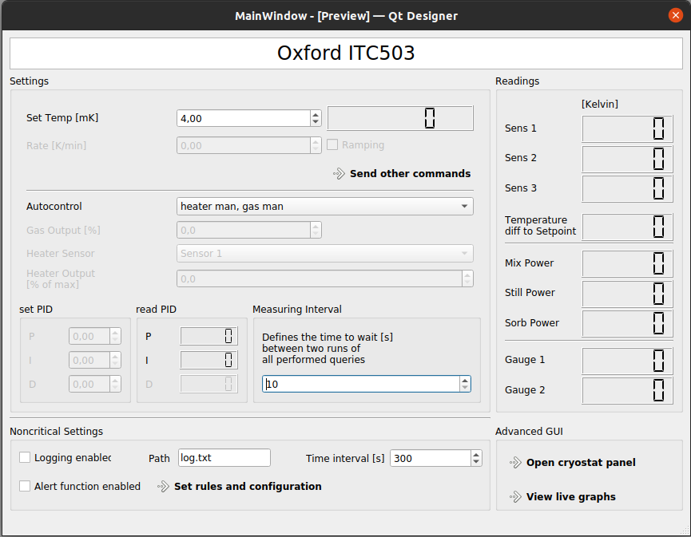
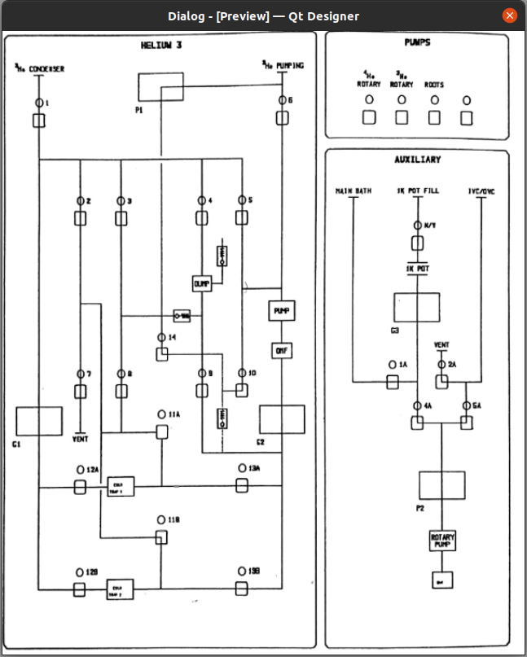
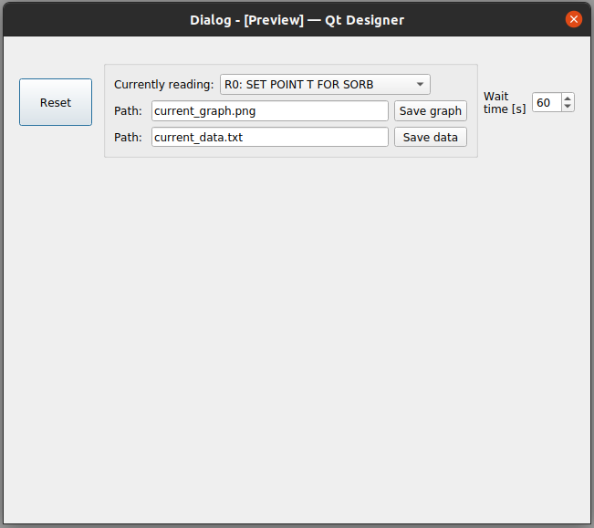
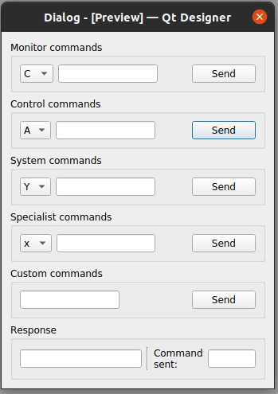
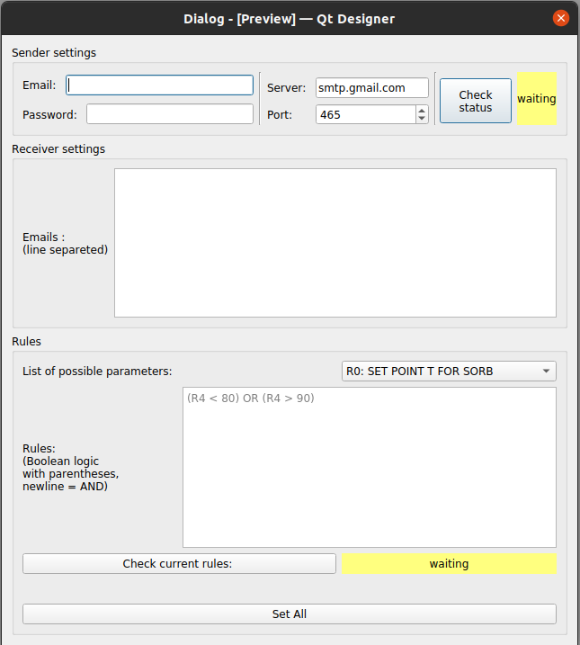

# GUI for Oxford ITC503 temperature controller
This gui was developed for ITC503 version **da aggiungere!**

## How to use
You can install all necessary packages by downloading **requirements.txt** and running:
```
pip install -r requirements.txt
```
Also note that this Gui opens an instance of Fridge_handler, an object that inherits from qcodes.VisaInstrument.
This class can easily be overritten since all used function are:
'''
execute(command) # sends command to ITC503 and returns responce
get_sens(sensor) # sends the specific command to read sensor number i (R+i). Returns read int
'''

## Funcionalities

#### Main Windowd


**Currently enabled:**
* Set temp button
* Set automode
* Basic readings (main temperatures), used power, gauge 1/2, P/I
* Define time beetween measurements
* Logging control
* Alert button
* Link to other windows

**Currently disabled:**
* Sweep functions
* Set PID, Read D
* Set Gas and Heater output

#### Panel Window


**Currently disabled:**
* Everything

#### Live Graphs Window


**Currently enabled:**
* Live graph of every sensor
* Saving of displayed data
* Saving of displayed graph (image)
* Set time beetween markers

#### Send Commands Window


**Currently enabled:**
* Send every command with custom parameters

#### Alert Window


**Currently enabled:**
* Permits to set basic boolean functions with sensor reading as parameters
* By setting up sender and receiver information an email will be send **every time normal reading are executed** (i.e. the time set in main window).

**Warning:** typically the sender email must be configured to permit use from third party apps.

## Known problems

* Live graphs window reset itself when another window is selected
* Panel window not yet implemented
